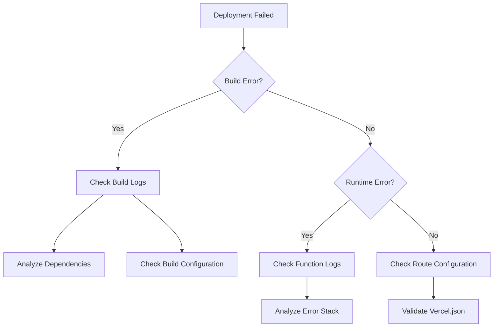
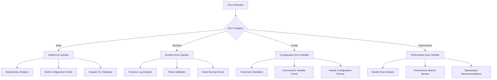

# Technical Design Document: Vercel Deployment Guide

## Overview

The Vercel Deployment Guide is a comprehensive technical documentation system designed to enable developers to successfully deploy Angular + Node.js applications to the Vercel platform. The guide addresses the complete deployment lifecycle from project preparation through production optimization, with specific focus on converting traditional Express.js backends to Vercel's serverless function architecture.

### Core Design Principles

1. **Modular Architecture**: The guide is structured as interconnected modules that can be consumed independently or as a complete workflow
2. **Template-Driven Approach**: Provides reusable configuration templates and boilerplate code to accelerate deployment
3. **Problem-Solution Mapping**: Each common deployment challenge is paired with specific, tested solutions
4. **Technology Stack Specificity**: Tailored for Angular 17+, Express.js, Tailwind CSS, Leaflet maps, and AI service integrations
5. **Progressive Complexity**: Starts with basic deployment and progresses to advanced optimization and troubleshooting

### Target Architecture

The guide supports deployment of applications with the following architecture:
- **Frontend**: Angular 17+ single-page application with client-side routing
- **Backend**: Express.js server converted to Vercel serverless functions
- **Static Assets**: CSS, JavaScript, images, and map tiles served via Vercel's edge network
- **External Integrations**: Google Gemini AI, mapping services, and third-party APIs
- **Build System**: Angular CLI with custom build configurations for Vercel optimization

## Architecture

### System Components

```mermaid
graph TB
    A[Deployment Guide System] --> B[Prerequisites Module]
    A --> C[Configuration Module]
    A --> D[Conversion Module]
    A --> E[Optimization Module]
    A --> F[Debugging Module]
    A --> G[Templates Module]
    
    B --> B1[Version Requirements]
    B --> B2[Dependency Analysis]
    B --> B3[Project Structure]
    
    C --> C1[Vercel Configuration]
    C --> C2[Build Settings]
    C --> C3[Environment Variables]
    
    D --> D1[Express to Serverless]
    D --> D2[Route Conversion]
    D --> D3[Middleware Adaptation]
    
    E --> E1[Bundle Optimization]
    E --> E2[Performance Tuning]
    E --> E3[Caching Strategies]
    
    F --> F1[Error Diagnostics]
    F --> F2[Log Analysis]
    F --> F3[Issue Resolution]
    
    G --> G1[Configuration Templates]
    G --> G2[Code Boilerplates]
    G --> G3[Deployment Checklists]
```



### Information Architecture

The guide follows a hierarchical structure optimized for both linear reading and random access:

1. **Entry Points**: Multiple pathways based on developer experience and project complexity
2. **Cross-References**: Extensive linking between related concepts and solutions
3. **Progressive Disclosure**: Basic concepts first, advanced topics accessible on-demand
4. **Context-Aware Navigation**: Recommendations based on technology stack and deployment stage

### Integration Patterns

The guide integrates with external systems and tools:
- **Vercel CLI**: Command-line interface integration for deployment automation
- **Angular CLI**: Build system integration and configuration
- **Package Managers**: npm/yarn workflow integration
- **Version Control**: Git-based deployment workflows
- **Monitoring Tools**: Integration with Vercel Analytics and external monitoring

## Components and Interfaces

### Prerequisites Module

**Purpose**: Validates project readiness for Vercel deployment

**Components**:
- Version Compatibility Checker
- Dependency Analyzer
- Project Structure Validator
- Environment Readiness Assessment

**Interface**:
```typescript
interface PrerequisitesChecker {
  validateAngularVersion(version: string): ValidationResult;
  validateNodeVersion(version: string): ValidationResult;
  analyzeDependencies(packageJson: PackageJson): DependencyReport;
  validateProjectStructure(projectPath: string): StructureReport;
}
```

**Key Outputs**:
- Compatibility matrix for Angular/Node.js versions
- Required dependency list with version constraints
- Project structure requirements checklist
- Environment variable template

### Configuration Module

**Purpose**: Generates and validates Vercel-specific configuration files

**Components**:
- Vercel.json Generator
- Build Configuration Manager
- Route Configuration Builder
- Header Configuration System

**Interface**:
```typescript
interface ConfigurationBuilder {
  generateVercelConfig(projectType: ProjectType): VercelConfig;
  buildRouteConfig(angularRoutes: Route[]): RouteConfig;
  generateBuildConfig(buildOptions: BuildOptions): BuildConfig;
  validateConfiguration(config: VercelConfig): ValidationResult;
}
```

**Configuration Templates**:

1. **Basic Angular + API Configuration**:
```json
{
  "version": 2,
  "builds": [
    {
      "src": "dist/**",
      "use": "@vercel/static"
    },
    {
      "src": "api/**/*.js",
      "use": "@vercel/node"
    }
  ],
  "routes": [
    {
      "src": "/api/(.*)",
      "dest": "/api/$1"
    },
    {
      "src": "/(.*)",
      "dest": "/index.html"
    }
  ]
}
```

2. **Advanced Configuration with Headers**:
```json
{
  "version": 2,
  "builds": [
    {
      "src": "dist/**",
      "use": "@vercel/static"
    },
    {
      "src": "api/**/*.js",
      "use": "@vercel/node"
    }
  ],
  "routes": [
    {
      "src": "/api/(.*)",
      "dest": "/api/$1",
      "headers": {
        "Access-Control-Allow-Origin": "*",
        "Access-Control-Allow-Methods": "GET, POST, PUT, DELETE, OPTIONS",
        "Access-Control-Allow-Headers": "Content-Type, Authorization"
      }
    },
    {
      "src": "/(.*\\.(js|css|png|jpg|jpeg|gif|svg|ico|woff|woff2|ttf|eot))",
      "headers": {
        "Cache-Control": "public, max-age=31536000, immutable"
      },
      "dest": "/$1"
    },
    {
      "src": "/(.*)",
      "dest": "/index.html"
    }
  ],
  "headers": [
    {
      "source": "/(.*)",
      "headers": [
        {
          "key": "X-Content-Type-Options",
          "value": "nosniff"
        },
        {
          "key": "X-Frame-Options",
          "value": "DENY"
        },
        {
          "key": "X-XSS-Protection",
          "value": "1; mode=block"
        }
      ]
    }
  ]
}
```

### Conversion Module

**Purpose**: Transforms Express.js applications to Vercel serverless functions

**Components**:
- Route Converter
- Middleware Adapter
- Request/Response Transformer
- Database Connection Manager

**Conversion Patterns**:

1. **Basic Express Route Conversion**:
```javascript
// Before: Express route
app.get('/api/users', (req, res) => {
  res.json({ users: [] });
});

// After: Vercel serverless function
export default function handler(req, res) {
  if (req.method === 'GET') {
    res.status(200).json({ users: [] });
  } else {
    res.setHeader('Allow', ['GET']);
    res.status(405).end(`Method ${req.method} Not Allowed`);
  }
}
```

2. **Middleware Conversion Pattern**:
```javascript
// Before: Express middleware
app.use(cors());
app.use(express.json());

// After: Serverless function with middleware
import Cors from 'cors';
import { runMiddleware } from '../utils/middleware';

const cors = Cors({
  methods: ['GET', 'POST', 'PUT', 'DELETE'],
});

export default async function handler(req, res) {
  await runMiddleware(req, res, cors);
  
  // Handle request
  res.json({ message: 'Success' });
}
```

**Interface**:
```typescript
interface ConversionEngine {
  convertRoute(expressRoute: ExpressRoute): ServerlessFunction;
  adaptMiddleware(middleware: ExpressMiddleware): ServerlessMiddleware;
  transformRequest(req: ExpressRequest): VercelRequest;
  transformResponse(res: ExpressResponse): VercelResponse;
}
```

### Optimization Module

**Purpose**: Optimizes applications for Vercel's edge network and serverless environment

**Components**:
- Bundle Analyzer
- Performance Optimizer
- Caching Strategy Manager
- Build Budget Controller

**Optimization Strategies**:

1. **Angular Build Optimization**:
```json
{
  "projects": {
    "app": {
      "architect": {
        "build": {
          "builder": "@angular-devkit/build-angular:browser",
          "options": {
            "outputPath": "dist",
            "index": "src/index.html",
            "main": "src/main.ts",
            "polyfills": "src/polyfills.ts",
            "tsConfig": "tsconfig.app.json",
            "assets": [
              "src/favicon.ico",
              "src/assets"
            ],
            "styles": [
              "src/styles.css"
            ],
            "scripts": [],
            "budgets": [
              {
                "type": "initial",
                "maximumWarning": "2mb",
                "maximumError": "5mb"
              },
              {
                "type": "anyComponentStyle",
                "maximumWarning": "6kb",
                "maximumError": "10kb"
              }
            ]
          }
        }
      }
    }
  }
}
```

2. **Lazy Loading Implementation**:
```typescript
const routes: Routes = [
  {
    path: 'feature',
    loadChildren: () => import('./feature/feature.module').then(m => m.FeatureModule)
  }
];
```

### Debugging Module

**Purpose**: Provides systematic debugging and troubleshooting capabilities

**Components**:
- Error Diagnostic Engine
- Log Analysis Tools
- Performance Profiler
- Issue Resolution Database

**Debugging Workflows**:

1. **Deployment Failure Diagnosis**:


2. **Performance Issue Resolution**:
```typescript
interface PerformanceAnalyzer {
  analyzeBundleSize(buildOutput: BuildOutput): BundleAnalysis;
  identifyBottlenecks(performanceMetrics: Metrics): Bottleneck[];
  suggestOptimizations(analysis: BundleAnalysis): Optimization[];
}
```

### Templates Module

**Purpose**: Provides reusable templates and boilerplate code

**Template Categories**:
1. Configuration Templates
2. Code Boilerplates
3. Deployment Scripts
4. Testing Templates
5. Documentation Templates

**Template Structure**:
```typescript
interface Template {
  id: string;
  name: string;
  description: string;
  category: TemplateCategory;
  variables: TemplateVariable[];
  files: TemplateFile[];
  dependencies: string[];
  instructions: string[];
}
```

## Data Models

### Project Configuration Model

```typescript
interface ProjectConfig {
  name: string;
  version: string;
  framework: {
    name: 'angular';
    version: string;
  };
  backend: {
    type: 'express' | 'serverless';
    runtime: 'nodejs14.x' | 'nodejs16.x' | 'nodejs18.x';
  };
  dependencies: Dependency[];
  buildSettings: BuildSettings;
  deploymentSettings: DeploymentSettings;
}

interface BuildSettings {
  outputDirectory: string;
  buildCommand: string;
  installCommand: string;
  nodeVersion: string;
  environmentVariables: EnvironmentVariable[];
}

interface DeploymentSettings {
  regions: string[];
  functions: FunctionConfig[];
  routes: RouteConfig[];
  headers: HeaderConfig[];
  redirects: RedirectConfig[];
}
```

### Serverless Function Model

```typescript
interface ServerlessFunction {
  path: string;
  method: HttpMethod[];
  handler: string;
  runtime: Runtime;
  memory: number;
  timeout: number;
  environment: EnvironmentVariable[];
  middleware: Middleware[];
}

interface Middleware {
  name: string;
  config: Record<string, any>;
  order: number;
}
```

### Error Diagnostic Model

```typescript
interface DiagnosticResult {
  id: string;
  severity: 'error' | 'warning' | 'info';
  category: 'build' | 'runtime' | 'configuration' | 'performance';
  message: string;
  details: string;
  suggestions: Suggestion[];
  relatedDocs: DocumentationLink[];
}

interface Suggestion {
  action: string;
  description: string;
  codeExample?: string;
  configExample?: string;
}
```

### Performance Metrics Model

```typescript
interface PerformanceMetrics {
  buildTime: number;
  bundleSize: {
    total: number;
    javascript: number;
    css: number;
    assets: number;
  };
  functionColdStart: number;
  functionExecutionTime: number;
  cacheHitRate: number;
  errorRate: number;
}
```

## Correctness Properties

*A property is a characteristic or behavior that should hold true across all valid executions of a system-essentially, a formal statement about what the system should do. Properties serve as the bridge between human-readable specifications and machine-verifiable correctness guarantees.*

After analyzing the acceptance criteria, I've identified several properties that can be consolidated to eliminate redundancy. Many of the conditional requirements follow similar patterns and can be combined into comprehensive properties.

### Property 1: External API Documentation Completeness

*For any* project configuration that includes external API integrations, the deployment guide should document environment variable setup requirements, security best practices, and integration patterns.

**Validates: Requirements 1.5, 5.3, 7.3, 10.4, 11.3, 11.5**

### Property 2: Configuration Generation Correctness

*For any* valid project specification, the build configuration system should generate vercel.json files with proper build settings, output directories, serverless function configurations, and appropriate commands.

**Validates: Requirements 2.1, 2.2, 2.3, 2.5**

### Property 3: Conditional Configuration Behavior

*For any* project that requires routing, custom headers, middleware adaptation, or build-time variables, the configuration system should include the appropriate settings and documentation.

**Validates: Requirements 2.4, 2.6, 3.3, 3.6, 7.6**

### Property 4: MIME Handler Response Correctness

*For any* static file type and MIME error scenario, the MIME handler should provide appropriate configuration solutions and set correct content-type headers.

**Validates: Requirements 4.1, 4.3, 4.4**

### Property 5: Debug System Diagnostic Completeness

*For any* deployment failure, API endpoint failure, or build budget warning, the debug system should provide appropriate diagnostic steps and optimization strategies.

**Validates: Requirements 5.1, 6.1, 8.4, 9.4**

### Property 6: Environment Manager Configuration Consistency

*For any* deployment environment (preview or production), the environment manager should configure appropriate variable sets and handle build-time variables when needed.

**Validates: Requirements 7.4, 7.6**

### Property 7: Build Optimization Application

*For any* Angular application with large dependencies, the build configuration should apply appropriate budget limits and optimization strategies for Vercel's edge network.

**Validates: Requirements 6.3, 6.5, 6.6**

### Property 8: Conditional Documentation Coverage

*For any* technology stack component (search functionality, Jest testing, map tiles, project variations), when that component is present, the deployment guide should provide appropriate documentation and configuration alternatives.

**Validates: Requirements 5.4, 8.4, 11.5, 12.6**

## Error Handling

### Error Classification System

The deployment guide implements a comprehensive error classification system to systematically address deployment failures:

```typescript
enum ErrorCategory {
  BUILD_ERROR = 'build',
  RUNTIME_ERROR = 'runtime', 
  CONFIGURATION_ERROR = 'configuration',
  PERFORMANCE_ERROR = 'performance',
  INTEGRATION_ERROR = 'integration'
}

enum ErrorSeverity {
  CRITICAL = 'critical',    // Deployment fails completely
  HIGH = 'high',           // Major functionality broken
  MEDIUM = 'medium',       // Performance or minor issues
  LOW = 'low'              // Warnings or optimization opportunities
}
```

### Error Detection Patterns

1. **Build-Time Error Detection**:
```typescript
interface BuildErrorDetector {
  detectDependencyConflicts(packageJson: PackageJson): DependencyError[];
  validateAngularConfiguration(angularJson: AngularConfig): ConfigError[];
  checkBuildBudgets(buildOutput: BuildOutput): BudgetError[];
  validateVercelConfiguration(vercelJson: VercelConfig): VercelError[];
}
```

2. **Runtime Error Detection**:
```typescript
interface RuntimeErrorDetector {
  detectServerlessErrors(functionLogs: FunctionLog[]): ServerlessError[];
  identifyRoutingIssues(requestLogs: RequestLog[]): RoutingError[];
  analyzeMimeTypeErrors(assetLogs: AssetLog[]): MimeError[];
  detectApiIntegrationFailures(apiLogs: ApiLog[]): IntegrationError[];
}
```

### Error Resolution Workflows



### Automated Error Recovery

The system provides automated recovery mechanisms for common issues:

1. **Configuration Auto-Correction**:
```typescript
interface AutoCorrection {
  fixRoutingConfiguration(config: VercelConfig): VercelConfig;
  correctMimeTypeSettings(headers: HeaderConfig[]): HeaderConfig[];
  optimizeBuildSettings(buildConfig: BuildConfig): BuildConfig;
  repairEnvironmentVariables(envVars: EnvironmentVariable[]): EnvironmentVariable[];
}
```

2. **Fallback Strategies**:
- Alternative build configurations for different project structures
- Backup routing rules for complex Angular applications
- Default MIME type configurations for unknown file types
- Standard environment variable templates

### Error Documentation Integration

Each error type is linked to specific documentation sections:

```typescript
interface ErrorDocumentation {
  errorCode: string;
  title: string;
  description: string;
  diagnosticSteps: DiagnosticStep[];
  solutions: Solution[];
  relatedDocuments: DocumentationLink[];
  codeExamples: CodeExample[];
}
```

## Testing Strategy

### Dual Testing Approach

The deployment guide system employs both unit testing and property-based testing to ensure comprehensive coverage:

**Unit Testing Focus**:
- Specific configuration template validation
- Individual error detection scenarios
- Integration points between modules
- Edge cases in conversion patterns
- Template generation accuracy

**Property-Based Testing Focus**:
- Universal properties across all project configurations
- Comprehensive input coverage through randomization
- Correctness properties validation
- System behavior under various conditions

### Property-Based Testing Configuration

**Testing Framework**: fast-check (JavaScript/TypeScript property-based testing library)
**Minimum Iterations**: 100 per property test
**Test Organization**: Each property test references its corresponding design document property

### Property Test Implementation Examples

1. **Configuration Generation Property**:
```typescript
// Feature: vercel-deployment-guide, Property 2: Configuration Generation Correctness
describe('Configuration Generation', () => {
  it('should generate valid vercel.json for any project specification', () => {
    fc.assert(fc.property(
      projectSpecificationArbitrary(),
      (projectSpec) => {
        const config = configurationBuilder.generateVercelConfig(projectSpec);
        
        expect(config.version).toBe(2);
        expect(config.builds).toBeDefined();
        expect(config.routes).toBeDefined();
        
        if (projectSpec.hasAngularRouting) {
          expect(config.routes.some(route => route.dest === '/index.html')).toBe(true);
        }
        
        if (projectSpec.hasServerlessFunctions) {
          expect(config.builds.some(build => build.use === '@vercel/node')).toBe(true);
        }
      }
    ), { numRuns: 100 });
  });
});
```

2. **Error Detection Property**:
```typescript
// Feature: vercel-deployment-guide, Property 5: Debug System Diagnostic Completeness
describe('Debug System', () => {
  it('should provide diagnostics for any deployment failure', () => {
    fc.assert(fc.property(
      deploymentFailureArbitrary(),
      (failure) => {
        const diagnostics = debugSystem.diagnose(failure);
        
        expect(diagnostics.length).toBeGreaterThan(0);
        expect(diagnostics.every(d => d.suggestions.length > 0)).toBe(true);
        expect(diagnostics.every(d => d.category !== undefined)).toBe(true);
      }
    ), { numRuns: 100 });
  });
});
```

### Unit Testing Strategy

**Test Categories**:
1. **Template Validation Tests**: Verify generated templates are syntactically correct
2. **Conversion Logic Tests**: Test Express to serverless function conversion accuracy
3. **Error Handling Tests**: Validate error detection and resolution workflows
4. **Integration Tests**: Test interaction between different modules
5. **Performance Tests**: Validate optimization strategies effectiveness

**Example Unit Tests**:
```typescript
describe('Express to Serverless Conversion', () => {
  it('should convert basic GET route correctly', () => {
    const expressRoute = {
      method: 'GET',
      path: '/api/users',
      handler: (req, res) => res.json({ users: [] })
    };
    
    const serverlessFunction = conversionEngine.convertRoute(expressRoute);
    
    expect(serverlessFunction.path).toBe('/api/users.js');
    expect(serverlessFunction.method).toContain('GET');
    expect(serverlessFunction.handler).toContain('req.method === \'GET\'');
  });
  
  it('should handle middleware conversion', () => {
    const middleware = {
      name: 'cors',
      config: { origin: '*' }
    };
    
    const adapted = conversionEngine.adaptMiddleware(middleware);
    
    expect(adapted.name).toBe('cors');
    expect(adapted.implementation).toContain('runMiddleware');
  });
});
```

### Testing Infrastructure

**Test Data Generation**:
```typescript
// Arbitraries for property-based testing
const projectSpecificationArbitrary = () => fc.record({
  name: fc.string(),
  angularVersion: fc.constantFrom('17.0.0', '17.1.0', '18.0.0'),
  nodeVersion: fc.constantFrom('18.x', '20.x'),
  hasServerlessFunctions: fc.boolean(),
  hasAngularRouting: fc.boolean(),
  hasExternalApis: fc.boolean(),
  dependencies: fc.array(dependencyArbitrary())
});

const deploymentFailureArbitrary = () => fc.record({
  type: fc.constantFrom('build', 'runtime', 'configuration'),
  error: fc.string(),
  logs: fc.array(fc.string()),
  context: fc.record({
    projectType: fc.string(),
    vercelConfig: fc.object(),
    buildOutput: fc.object()
  })
});
```

**Test Environment Setup**:
- Mock Vercel CLI for deployment testing
- Simulated build environments for configuration testing
- Test project templates for conversion testing
- Performance benchmarking infrastructure

### Continuous Integration

**Test Execution Pipeline**:
1. Unit tests run on every commit
2. Property-based tests run on pull requests
3. Integration tests run on release candidates
4. Performance tests run on scheduled intervals

**Quality Gates**:
- 95% code coverage requirement
- All property tests must pass 100 iterations
- Performance benchmarks must meet baseline requirements
- Documentation examples must be executable

This comprehensive testing strategy ensures the deployment guide system maintains high reliability while providing accurate, actionable guidance for developers deploying Angular + Node.js applications to Vercel.